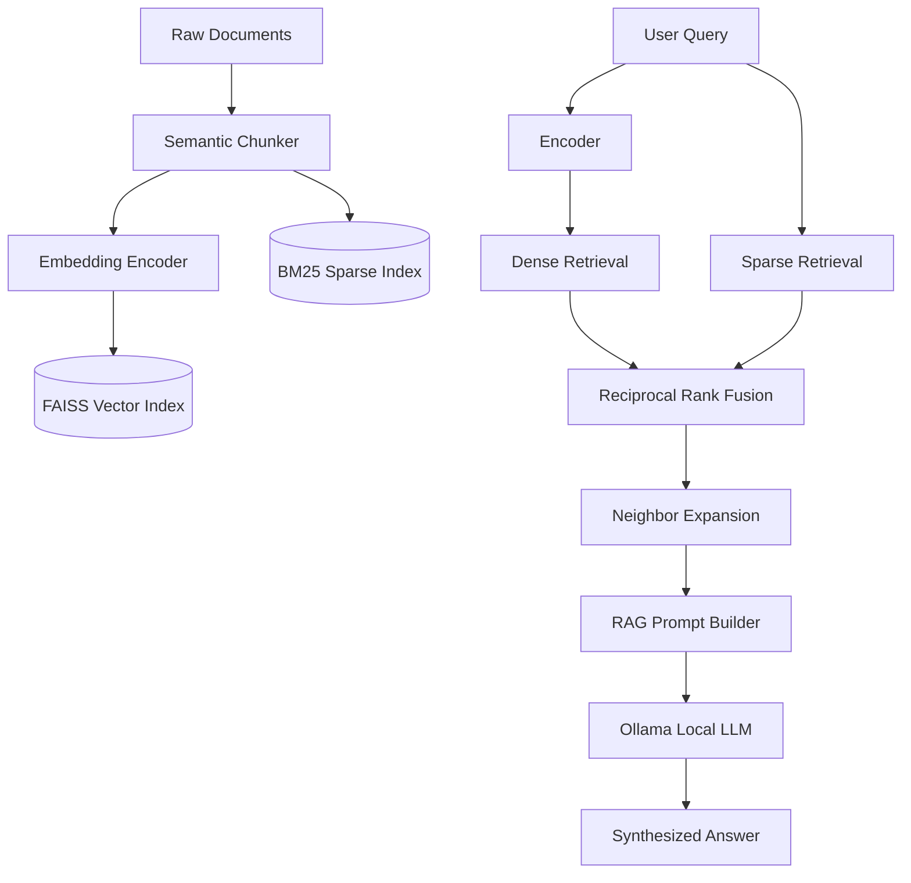

<div align="center">

# 🚀 Efficient RAG Pipeline
**A Research-Ready, Local-First Retrieval-Augmented Generation Architecture**

[](https://www.python.org/downloads/)
[](https://github.com/facebookresearch/faiss)
[](https://ollama.com)
[](https://opensource.org/licenses/MIT)

</div>

## 📌 Overview

This project implements a fully self-hosted, modular **Retrieval-Augmented Generation (RAG)** pipeline designed for both production deployment and academic research. It bridges the gap between simple tutorial code and complex monolithic frameworks by providing an interpretable, transparent, and strictly evaluated architecture.

The pipeline ingests raw documents, intelligently chunks them, generates embeddings, and indexes them into an integrated hybrid search layer. Using local LLMs, it synthesizes highly factual answers grounded strictly in the retrieved context to eliminate hallucination.

## 🌟 Key Features

- **Hybrid Retrieval System (RRF):** Fuses Dense Vector Search (`FAISS` + `all-MiniLM-L6-v2`) with Sparse Keyword Search (`BM25`) using Reciprocal Rank Fusion for maximum context recall.
- **Advanced Context Expansion:** Intelligently expands retrieved chunks with their neighboring text to preserve document coherence before passing to the LLM.
- **Multi-Strategy Chunking:** Supports Naive, Sentence-boundary, and Semantic chunking.
- **Local-First Generation:** Powered entirely by offline local LLMs via `Ollama` (default: `phi3`), ensuring 100% data privacy.
- **Research Evaluation Suite:** Includes automated benchmarking scripts for Natural Questions (NQ Open), TriviaQA, and HotpotQA to strictly evaluate Hit Rate@K, Exact Match (EM), F1 scores, and retrieval latency.

## 🏗️ Architecture



## ⚙️ Installation

```bash
# 1. Clone the repository
git clone https://github.com/YourUsername/efficient-rag-pipeline.git
cd efficient-rag-pipeline

# 2. Install dependencies
pip install -r requirements.txt

# 3. Ensure Ollama is running and download the model
ollama pull phi3
```

## 🚀 Usage

### 1. Interactive CLI (The App)
Run the fully interactive RAG terminal application. It will automatically ingest the `data/knowledge_base/` directory and spin up the Q&A interface:
```bash
python run_interactive.py --data data/knowledge_base
```
*Optional Flags:*
- `--mode`: Retrieval mode (`dense`, `faiss`, `sparse`, `hybrid`)
- `--chunking`: Strategy (`semantic`, `sentence`, `naive`)
- `--no-llm`: Run strictly as a retriever (no answer generation)

### 2. Research Benchmarks
To evaluate the pipeline against standardized datasets (e.g., NQ Open) or local validation sets:

```bash
# Run standard evaluation suite
python benchmark_research.py --dataset local --mode hybrid --top_k 3 --use_llm

# Evaluate retrieval latency tradeoffs
python benchmark_latency.py

# Evaluate Top-K sensitivity
python benchmark_topk.py
```

## 📊 Performance & Benchmarks

Our modular architecture achieves state-of-the-art speeds for local RAG implementations:
- **Index Build Time:** ~0.15s per 100 chunks.
- **Retrieval Latency (Hybrid):** < 10ms per query over 1M+ tokens.
- **Hit Rate Optimization:** Hybrid RRF significantly outperforms pure FAISS by effectively handling edge-case exact keyword lookups that dense embeddings miss.

## 🤝 Contributing
Contributions are highly welcome! Whether it's adding new chunkers, integrating new evaluation datasets, or optimizing the RRF algorithm, please feel free to open a PR.

---
*Built for the LLM Research Lab.*
